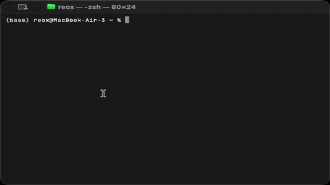

# Ternary Bonsai 2 27B on the Zhouyi NPU

Text generation with PrismML's [Ternary Bonsai 2 27B](https://huggingface.co/prism-ml/Ternary-Bonsai-2-27B-gguf) on the NPU of
the Radxa Orion O6N, through the `ZHOUYI` backend of tinygrad (the repository's `tinygrad/` submodule).

Bonsai 2 27B is [Qwen3.8-27B](https://huggingface.co/Qwen/Qwen3.8-27B-FP8) with its architecture unchanged and every linear
layer, the embedding and the output head stored as **ternary weights**: each weight is -1, 0 or +1, with one fp16 scale per
128 weights, in a blockwise Hadamard-rotated basis. The `PTQ1_0` GGUF is 5.9 GB, against 27 GB for Qwen3.8-27B in FP8. The model
and its GGUF are PrismML's, under the Apache-2.0 license; see their [model card](https://huggingface.co/prism-ml/Ternary-Bonsai-2-27B-gguf),
[website](https://prismml.com) and [whitepaper](https://github.com/PrismML-Eng/Bonsai-demo/blob/main/bonsai-2-27b-whitepaper.pdf).

**Status: it generates.** Plain greedy decoding runs at 2.1 tok/s. With speculative decoding (the default) it runs at
**~6.2 tok/s**, and ~7.5 tok/s on code, with the same tokens as plain greedy decoding.



*Served from the board ([Serve](#serve-openai--and-ollama-compatible-api)) and asked with `ollama run --verbose` on a Mac: 208 tokens at 4.8 tok/s.*

## What runs where

- **On the NPU:** all 64 layers (48 Gated DeltaNet + 16 full attention), the output head, the prompt's prefill, and the draft
  model of speculative decoding. Every linear runs on a **ternary GEMM** that reads the 2-bit codes directly (0.28 bytes a
  weight against FP8's 1.03), so a token streams ~8 GB of weights instead of 26 GB.
- **On the host:** the tokenizer, the prompt's embedding and its first token, and reading the generated ids to print them. In
  speculative decoding every later token id stays on the NPU (`QWEN_NPU_IDS=1`, the default): the head picks it
  (`head_reduce`), the embedding is decoded and rotated there (`embed_tern`), the drafts are accepted (`accept`) and fed back to the
  drafter (`pick_id`, `mtp_in`); the host only reads the ids and the draft probabilities to choose the next pass's size.

The model runs on the same modules as [qwen3.8-27b](../qwen3.8-27b/) with `QWEN_MODEL=bonsai2-27b`. Only the weight format and
the input transform differ (see "How it works" below).

## Requirements

The backend's requirements, listed in the [root README](../README.md#requirements-on-the-board):

- the Zhouyi NPU kernel driver with its header `armchina_aipu.h` and its zero-copy weight buffers (the WBUF / SLOT ioctls),
- libclang for the first run (`LIBCLANG_PATH` if your distribution ships only a versioned library),
- the vendor's AIPU toolchain library,
- Python 3.12 or newer with `numpy` and `tokenizers` (`pip install numpy tokenizers`).

On top of that: **~15 GB of disk** (5.9 GB GGUF, 0.5 GB of Qwen3.8-27B files, 8.2 GB packed cache) and **~10 GB of free RAM**
(the packed layers are held in RAM; the board has 29 GB).

The paths below (`/mnt/ssd/...`) are examples and the scripts' defaults: set `BONSAI_DIR`, `BONSAI_GGUF` and `QWEN_NPU` to your
own paths.

## Download

```sh
cd bonsai2-27b
BONSAI_DIR=/mnt/ssd/bonsai2 bash download.sh      # about 6.4 GB; resumable; --dry-run lists the files
```

This fetches two things into `$BONSAI_DIR` (default `/mnt/ssd/bonsai2`; set it to your path):

- from [prism-ml/Ternary-Bonsai-2-27B-gguf](https://huggingface.co/prism-ml/Ternary-Bonsai-2-27B-gguf): `Ternary-Bonsai-2-27B-PTQ1_0.gguf`
  and its license files;
- from [Qwen/Qwen3.8-27B-FP8](https://huggingface.co/Qwen/Qwen3.8-27B-FP8), into `$BONSAI_DIR/qwen3.8-27b-mtp`: only
  `mtp.safetensors` (0.48 GB, the draft model's weights; see below), `tokenizer.json` and the small config and license files.
  Not the 27 GB checkpoint.

A Hugging Face token is not needed; if `~/.hf_token` exists, it is sent.

## Pack

The packer converts the GGUF into the per-layer cache the NPU streams (`QWEN_NPU`, default `/mnt/ssd/bonsai2-npu`; set it to
your path). Times are on the board:

```sh
export BONSAI_GGUF=/mnt/ssd/bonsai2/Ternary-Bonsai-2-27B-PTQ1_0.gguf QWEN_NPU=/mnt/ssd/bonsai2-npu
python3 bonsai2_pack.py                                    # the 64 layers, ~3 min
python3 bonsai2_pack.py --head                             # the output head and the final norm, ~10 s
python3 bonsai2_pack.py --fuse                             # the same-input projections as one GEMM each, ~1 s
python3 bonsai2_pack.py --mtp /mnt/ssd/bonsai2/qwen3.8-27b-mtp   # the drafter and tokenizer.json, ~4 s
```

`--mtp` packs Qwen3.8-27B's multi-token-prediction (MTP) layer into the subfolder `$QWEN_NPU/mtp`, where the generator looks for
it, and copies the tokenizer into the cache. The MTP layer stays in FP8 (block-scaled E4M3), so it has its own folder with its
own format markers.

The scale tables are stored as fp16 (2.125 bits a weight instead of 2.25 for fp32, 5.6 % fewer bytes a pass; the GEMM's output
is bit-identical, so the tokens are the same). `--tscale f32` packs the older fp32 tables. A cache packed with fp32 tables can be
converted into a new folder (no GGUF read, ~15 s on the board; the tool stops if any scale is not exact in fp16):

```sh
python3 bonsai2_repack_f16.py --src /mnt/ssd/bonsai2-npu --out /mnt/ssd/bonsai2-npu-f16   # then QWEN_NPU=/mnt/ssd/bonsai2-npu-f16
```

The cache's `tscale` file selects the format; a cache without it is read as fp32.

## Run

```sh
python3 bonsai2_generate.py "Write a Python function that returns the n-th Fibonacci number." --max-new 120
QWEN_SPEC=0 python3 bonsai2_generate.py "Explain why the sky is blue to a ten-year-old." --max-new 120   # plain decoding
```

The prompt goes through the chat template (thinking off; `--thinking` turns it on). Decoding is greedy until `<|im_end|>` or
`--max-new`. `--raw` skips the template, and `--out ids.npz` saves the generated ids. Model set-up takes ~20 s a run (9 s for
plain decoding), and the prefill runs at ~1.6 tok/s (24 tokens in 15 s).

Without the drafter in `$QWEN_NPU/mtp`, the generator says so and decodes plainly.

## Serve (OpenAI- and Ollama-compatible API)

`bonsai2_serve.py` loads the model once and serves it over HTTP with Python's standard library (no extra packages). It speaks
two APIs on one port:

- **OpenAI:** `GET /v1/models`, `POST /v1/chat/completions` (system / user / assistant messages; streaming with `"stream": true`,
  and the token counts at the end with `stream_options.include_usage`) and `POST /v1/completions` (raw text, no chat template).
- **Ollama:** `HEAD /`, `GET /api/tags`, `GET /api/version`, `POST /api/show`, `POST /api/chat` and `POST /api/generate`
  (newline-delimited JSON, streaming by default; `"stream": false` for one reply; `options.num_predict` and `options.stop`).
  Every route is also accepted under a `/v1` prefix, so a client given the OpenAI base URL still finds them.

The generic server is [`qwen3.8-27b/qwen38_serve.py`](../qwen3.8-27b/qwen38_serve.py); `bonsai2_serve.py` is that server with
this example's paths, drafter and decoding defaults (the [Settings](#settings) below).

### Start

```sh
cd bonsai2-27b
export BONSAI_GGUF=/mnt/ssd/bonsai2/Ternary-Bonsai-2-27B-PTQ1_0.gguf QWEN_NPU=/mnt/ssd/bonsai2-npu   # your paths
python3 bonsai2_serve.py --host 0.0.0.0 --port 8000 [--tmax 2048]
```

- `--host` defaults to `127.0.0.1` (this machine only); `0.0.0.0` accepts connections from the network.
- `--tmax` is the context in tokens, prompt plus output (default 2048).
- `--model-name` (or `QWEN_SERVE_NAME`) sets the name the server reports (default `bonsai2-27b`).

The model is ready when the server prints `== serving bonsai2-27b on http://...`.

### Run it as a service

An example systemd unit, `/etc/systemd/system/bonsai2.service` (replace `<user>` and `<path>`):

```ini
[Unit]
Description=Ternary Bonsai 2 27B on the Zhouyi NPU (OpenAI / Ollama API)
After=network-online.target

[Service]
Type=simple
User=<user>
WorkingDirectory=<path>/tinygrad-npu-examples/bonsai2-27b
ExecStart=/usr/bin/python3 bonsai2_serve.py --host 0.0.0.0 --port 8000
Restart=on-failure
RestartSec=10

[Install]
WantedBy=multi-user.target
```

If your model files are not at the default paths, add them to `[Service]`, e.g.
`Environment=BONSAI_GGUF=/data/bonsai2/Ternary-Bonsai-2-27B-PTQ1_0.gguf QWEN_NPU=/data/bonsai2-npu`. Then:

```sh
sudo systemctl daemon-reload
sudo systemctl enable --now bonsai2.service
journalctl -u bonsai2.service -f          # the log; the model is ready at "== serving ..."
```

### The CPU-latency request

While it runs, the decode process holds a 0 µs CPU-latency request on `/dev/cpu_dma_latency` (`QWEN_CPU_LATENCY`, default `0`;
`off` disables it). Without it, the CPU that takes the NPU's interrupt drops into deep idle states between a job's kernel groups,
and decoding is slower. The device is root-only by default; the process then prints a note
(`QWEN_CPU_LATENCY: no PM QoS request ...`) and runs without it. To let the `users` group hold the request, add a udev rule:

```sh
echo 'KERNEL=="cpu_dma_latency", GROUP="users", MODE="0660"' | sudo tee /etc/udev/rules.d/60-cpu-dma-latency.rules
sudo udevadm control --reload && sudo udevadm trigger --name-match=cpu_dma_latency
```

The user running the server must be in the `users` group (`id <user>`; `sudo usermod -aG users <user>`, then log in again).
The request is released when the process exits.

### Reaching the board by name

With Avahi (mDNS) running on the board (`sudo apt install avahi-daemon` if it is not), clients on the same network reach it by
its host name as `http://<hostname>.local:8000`. Below, `<board>` stands for that name or the board's address.

### Consuming with Ollama clients

The Ollama CLI talks to the board when `OLLAMA_HOST` points at it:

```sh
export OLLAMA_HOST=http://<board>:8000
ollama list                               # bonsai2-27b
ollama run bonsai2-27b                    # an interactive chat
ollama run --verbose bonsai2-27b "Write a Python function that returns the n-th Fibonacci number."   # + the eval rate
```

`--verbose` prints the prompt's processing time and the generation's eval rate (the tokens after the first over the time after
the first token).

GUI apps that speak Ollama's API (e.g. Enchanted): set the server URL to `http://<board>:8000`.

With curl:

```sh
curl http://<board>:8000/api/chat -d '{"model": "bonsai2-27b", "messages": [{"role": "user", "content": "Hello"}]}'
curl http://<board>:8000/api/chat -d '{"model": "bonsai2-27b", "messages": [{"role": "user", "content": "Hello"}], "stream": false}'
curl http://<board>:8000/api/generate -d '{"model": "bonsai2-27b", "prompt": "Why is the sky blue?", "options": {"num_predict": 128}}'
```

`/api/generate` applies the chat template (with `system` as the system turn, if given); `"raw": true` sends the prompt as is.

### Consuming with OpenAI clients

With curl, streaming and not:

```sh
curl http://<board>:8000/v1/chat/completions -H 'Content-Type: application/json' \
     -d '{"model": "bonsai2-27b", "messages": [{"role": "user", "content": "Hello"}], "stream": true}'
curl http://<board>:8000/v1/chat/completions -H 'Content-Type: application/json' \
     -d '{"model": "bonsai2-27b", "messages": [{"role": "user", "content": "Hello"}], "max_tokens": 128}'
```

With the `openai` Python package (`pip install openai`); the API key is not checked, any value works:

```python
from openai import OpenAI

client = OpenAI(base_url="http://<board>:8000/v1", api_key="none")
stream = client.chat.completions.create(
    model="bonsai2-27b",
    messages=[{"role": "user", "content": "Write a Python function that returns the n-th Fibonacci number."}],
    stream=True,
)
for chunk in stream:
    print(chunk.choices[0].delta.content or "", end="", flush=True)
```

### Behaviour

- **Greedy decoding.** `temperature`, `top_p` and `seed` are accepted and ignored; `n` must be 1. `max_tokens` /
  `max_completion_tokens` (Ollama: `options.num_predict`; default 512) and `stop` work.
- **One request at a time** runs on the NPU; others wait in line. The tokens stream as the verify passes accept them.
- **The context is `--tmax`** tokens (default 2048), prompt plus output; a longer prompt is refused, and the output stops at the
  context's end.
- **Prompt speed.** The prompt goes through the verify path, 4 tokens a pass, at ~7 tok/s, so a long chat history delays the first
  token (each request processes the whole conversation again). Its tokens can differ from the one-pass prefill's where two
  logits nearly tie; on the Fibonacci prompt the 120 tokens equal plain greedy decoding's.
- **Generation speed** depends on how predictable the text is: ~7.5 tok/s on code, ~4.8 tok/s on free prose.
- **Thinking** is off unless the request turns it on: `"chat_template_kwargs": {"enable_thinking": true}` (OpenAI) or
  `"think": true` (Ollama).

## Speed

Measured on the board with the NPU clocks at their defaults, the host on CPUs 0 and 1 (`QWEN_CPUS=0,1`: CPU 0 takes the NPU's
interrupt; the default `auto` picks it and one CPU of the same speed) and holding the 0 µs CPU-latency request
([above](#the-cpu-latency-request)), 120 new tokens each, wall time after the first token, the prefill excluded. Every
speculative run returned exactly the plain greedy tokens.

The published backend and the generator's defaults (fp16 scale tables, the leaf tree, kernel code in GM), on three of
qwen3.8-27b's exploration prompts (plain: 40 tokens), one session, the board shared with other jobs (not running at the same
time):

| prompt | plain | speculative, default drafter |
| --- | ---: | ---: |
| e0 Fibonacci in Python | 2.16 | 7.47 |
| e4 a short story's opening | 2.13 | 4.78 |
| e8 a train journey's length, step by step | 2.13 | 6.96 |
| **the three together** | **2.14** | **6.17** |

The previous release's build, for comparison:

| prompt | plain (40 tokens) | speculative, defaults |
| --- | ---: | ---: |
| Fibonacci in Python | 2.03 | 6.71 |
| a short story's opening | | 4.28 |
| a train journey's length, step by step | | 6.28 |
| **the three together** | | **5.58** |

Over ten varied prompts that build averaged 5.34 tok/s.

Code and step-by-step reasoning draft best; free prose drafts worst.

## Speculative decoding

The GGUF has no draft model, so the drafter is Qwen3.8-27B's MTP layer (see "How it works"). Each pass verifies up to 4 rows: the
current token, the drafter's chain (it keeps drafting while the chain's probability is at least `QWEN_TREE_TC`), and in the rows
left, the drafts' second and third candidates as extra leaves, which cost no extra draft pass. Every emitted token is the verify
pass's own argmax, so the output is the same as plain greedy decoding.

### Settings

`bonsai2_generate.py` sets these defaults. Everything else is shared with qwen3.8-27b and documented in the
[root README](../README.md#configuration-qwen38-27b-bonsai-2-and-ornith).

| variable | default | what it does |
| --- | --- | --- |
| `BONSAI_GGUF` | `/mnt/ssd/bonsai2/Ternary-Bonsai-2-27B-PTQ1_0.gguf` | the checkpoint (the host reads the embedding rows from it). Set it to your path |
| `QWEN_NPU` | `/mnt/ssd/bonsai2-npu` | the packed cache. Set it to your path |
| `QWEN_TOK` | the cache | the folder holding `tokenizer.json` |
| `QWEN_MTP_CACHE` | `$QWEN_NPU/mtp` | the drafter's cache: Qwen3.8-27B's MTP layer, in FP8 with single-layout scales |
| `QWEN_MTP_HEAD` | `bonsai` | the draft head: Bonsai's own ternary head, or `qwen`: Qwen3.8-27B's FP8 head, read from `QWEN_MTP_CACHE` |
| `QWEN_MTP_EMBED` | `bonsai` | the drafted token's embedding: Bonsai's, or `qwen`: Qwen3.8-27B's table, from `QWEN_MTP_DIR` |
| `QWEN_MTP_DIR` | unset | Qwen3.8-27B-FP8's folder (its `outside.safetensors`), needed only with `QWEN_MTP_EMBED=qwen` |
| `QWEN_SPEC` | `4` | rows of a verify pass at most (the token + up to 3 drafts); `0` decodes plainly |
| `QWEN_SPEC_GEOS` | `2,3,4` | the verify pass sizes prepared at start-up (with the leaf tree: every size from 2 to `QWEN_SPEC`) |
| `QWEN_DRAFT_MAX` | `3` | drafts a pass at most |
| `QWEN_SPEC_TREE` | `leaf` | the verify rows the chain leaves free take the drafts' 2nd / 3rd candidates; `off`: the chain only |
| `QWEN_TREE_TC` | `0.5` | with the leaf tree: keep drafting while the chain's probability is at least this |
| `QWEN_DRAFT_TAU` | `0.2` (`0.4` with the Qwen head) | without the leaf tree (`QWEN_SPEC_TREE=off`): keep drafting while the draft head's probability is at least this |
| `QWEN_DRAFT_PARTS` | `2` (`2,thresh:20` with the Qwen head) | the draft head reads the first 2 of the head's 4 parts (token ids < 124 416) |
| `QWEN_CPUS`, `QWEN_CPU_LATENCY` | `auto`, `0` | the host's CPU pinning and the CPU-latency request ([above](#the-cpu-latency-request)) |

`QWEN_SPEC_TREE` is not available for this model.

**The Qwen-head option (+3 %).** If you already have Qwen3.8-27B packed for the [qwen3.8-27b](../qwen3.8-27b/) example, with
single-layout scales (`qwen38_pack.py --scales single`, or `qwen38_repack_scales.py`), its FP8 head (`--lm-head-fp8`) and its MTP
layer (`--mtp`), the drafter can use Qwen3.8-27B's own head, which the MTP layer was trained with:

```sh
QWEN_MTP_CACHE=/mnt/ssd/qwen3.8-27b-npu-s1 QWEN_MTP_HEAD=qwen QWEN_MTP_EMBED=qwen QWEN_MTP_DIR=/mnt/ssd/qwen3.8-27b-fp8 \
  python3 bonsai2_generate.py "Write a Python function that returns the n-th Fibonacci number." --max-new 120
```

It needs the 27 GB checkpoint and its pack, plus 0.66 GB more RAM for the head's two parts. Measured on ten prompts with an
earlier, slower ternary GEMM: plain 1.07 tok/s, the default drafter 2.39 tok/s, the Qwen head 2.47 tok/s. The embedding switch
alone is worth under 1 %.

## How correctness is checked

- **The reference.** `bonsai2_ref.py` is a numpy fp32 forward pass of the GGUF. On the reference prompt (12 tokens) its greedy
  continuation matches PrismML's reference implementation for 10 of 10 tokens, and its PTQ1_0 decoder is bit-identical to
  that implementation's.
- **The pack.** `check/check_pack.py --cache $QWEN_NPU [--layers 0-3] [--head]` (no device) unpacks every stream of the cache and
  requires the GGUF's decoded weights back after the documented folding: the codes, the scales, the padding, the fused files,
  the small tensors, the Hadamard signs and the head parts.
- **The NPU's arithmetic against the reference.** `check/emulate_layer.py --cache $QWEN_NPU --layers 0,3` (no device) emulates
  what the device does with the cache -- the Hadamard-rotated fp16 inputs, the ternary GEMM's accumulation order and scales --
  inside the reference's layer math, and compares it with the GGUF reference. On the board, single layers are within 2.2e-4 of
  the reference's layer output at 1 to 21 rows, and greedy decoding on the NPU gives the same 10 tokens 10/10, with every step's
  top logits within 0.002 of the numpy reference's.
- **Speculative against plain.** Every token is the verify pass's own argmax, so speculative decoding must return exactly the
  ids of plain greedy decoding. `check/verify_oracle.py` (on the board) decodes 40 tokens plainly, then runs the verify / commit
  loop with oracle drafts (every third pass with a wrong last draft, so passes reject too) over the verify geometries, and
  prints `EXACT` when the ids are equal. On the board this held on 70 runs (7 drafter configurations x 10 prompts) and on every
  run of the speed table.

```sh
python3 check/check_pack.py --cache $QWEN_NPU --head
python3 check/emulate_layer.py --cache $QWEN_NPU --layers 0,3
QWEN_SPEC=8 QWEN_SPEC_GEOS=3,4,6,8 python3 check/verify_oracle.py
```

## How it works

- **The ternary GEMM.** The backend's `gemm_gs(tern=True)` streams each weight as a 2-bit code with one fp16 scale per row and
  128-wide K block. The GGUF's `PTQ1_0` block is 128 weights along K with one scale, so it maps onto one K slice of the GEMM and
  its scale is stored as is. The kernel expands the codes to fp16 before multiplying; at 1 to 4 rows it keeps up with the
  weight stream. A verify pass through the 64 layers costs 0.37-0.39 s at 2 to 4 rows.
- **The Hadamard producers.** Bonsai stores each weight as W' = W diag(s) H, with H a 1024-point Walsh-Hadamard transform
  and s fixed +-1 signs per input width, so each linear's input must be rotated the same way. The kernels that already write
  each GEMM's fp16 input (after the RMSNorms, after SwiGLU, after attention) run the 10 butterfly stages of the transform in
  local memory on the way (`had_a32` in `qwen38_kernels.py`; `had_a32d` in decode and verify, which moves every operand
  by DMA and does the in-register butterfly stages with lane extracts: 39-106 us a call at 4 rows). The 1/32 normalisation is
  folded into the weight scales. The signs are folded into the norm weights where that is exact and multiplied in where it is
  not. The cost is under 0.1 % of the GEMMs' work.
- **The borrowed MTP drafter.** The GGUF has no draft model. Bonsai is Qwen3.8-27B's architecture in the same residual
  coordinates (the rotation sits only inside the linears), so Qwen3.8-27B's MTP layer can be fed Bonsai's final hidden state
  without any change of basis. It runs on the NPU in FP8, in its own memory slot, and drafts through Bonsai's own ternary head.
  74 % of first drafts are accepted, and 64-69 % of the second and third.
- **The leaf tree, and the 5-row step.** A verify pass of 2, 3 or 4 rows costs 0.37-0.39 s (less than a plain decode step's
  0.49 s, because the decode path's kernels differ). The drafter drafts while its chain's probability stays >= 0.5
  (`QWEN_TREE_TC`), and the rows left of the 4 take the drafts' second and third candidates, which need no extra draft pass
  (`QWEN_SPEC_TREE=leaf`, the default: 2.63 tokens a pass instead of 2.57). The ternary GEMM works in tiles of 4 rows, and a
  5th row costs ~+80 ms a pass (rows 6-8 then ~+10 ms each), more than the deeper drafts or extra leaves win back, so the
  default stays at 4 rows.

## Files

| file | what |
| --- | --- |
| `download.sh` | the GGUF, and the Qwen3.8-27B MTP weights and tokenizer |
| `bonsai2_pack.py` | the GGUF -> the NPU cache (ternary streams, the Hadamard signs, the head in parts); `--mtp`: the drafter |
| `bonsai2_repack_f16.py` | an fp32-table cache -> a new cache with fp16 scale tables (exact, or it stops) |
| `bonsai2_generate.py` | generation on the NPU (`qwen3.8-27b/qwen38_generate.py` with `QWEN_MODEL=bonsai2-27b` and the defaults above) |
| `bonsai2_serve.py` | the OpenAI- and Ollama-compatible server (`qwen3.8-27b/qwen38_serve.py` with these defaults) |
| `bonsai2_gguf.py`, `bonsai2_weights.py` | the GGUF reader, the `PTQ1_0` decoder and the Hadamard contract; the GGUF under the HF tensor names |
| `bonsai2_ref.py` | the numpy reference forward pass |
| `serve-demo.gif` | the recording above |
| `check/check_pack.py` | the pack round trip (no device) |
| `check/emulate_layer.py` | a host emulation of the NPU's layers and head from the cache, against the reference (no device) |
| `check/verify_oracle.py` | the verify path against plain greedy decoding, on the board |
