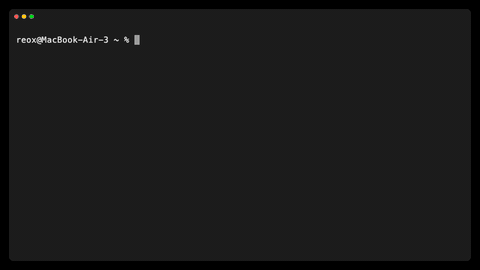

# Gemma 4 E2B and E4B on the Zhouyi NPU

Text generation with Google's [Gemma 4 E2B](https://huggingface.co/google/gemma-4-E2B) and
[Gemma 4 E4B](https://huggingface.co/google/gemma-4-E4B) (the instruction-tuned `-it` models) on the NPU of the Radxa Orion
O6N, through the `ZHOUYI` backend of tinygrad (the repository's `tinygrad/` submodule). The model is read from its **Q8_0 GGUF**
(int8 weights with an fp16 scale per 32); every decoder layer and the output head run on the NPU on an exact Q8_0 GEMM, and so
does the model's **multi-token-prediction (MTP) draft head**, which drafts for speculative decoding. The models and their
license are Google's; see the model cards.

**Status: it generates, at ~18 tok/s on E2B and ~11 tok/s on E4B with speculative decoding** (the default when the draft head
is there), 8.2 and 4.3 tok/s with plain greedy decoding. Every speculative run returned exactly the tokens of plain greedy
decoding on the NPU, which equal llama.cpp's CPU greedy decoding of the same GGUF (one exception, at a near-tie: below). The
prompt runs 8 tokens a pass: a 1074-token prompt takes 23.3 s on E2B (39.0 s on E4B).

## The model

| | E2B | E4B |
| --- | --- | --- |
| layers | 35: 28 sliding-window ("local", window 512) + 7 global (every 5th layer) | 42 |
| hidden / MLP | 1536 / 6144 (layers 0-14), 12 288 (layers 15-34); GeGLU (tanh GELU) | 2560 / 10 240 |
| attention | 8 query heads, 1 KV head; head dim 256 (local) / 512 (global); q / k RMSNorm, v RMSNorm without weight, scale 1; RoPE theta 1e4 (local) / 1e6 (global, on 64 of the 256 frequencies) | 2 KV heads |
| KV sharing | layers 15-34 compute no K / V: they read the caches of the last earlier layer of the same kind (14 or 13) | the caches of layers 22 (local) / 23 (global) |
| per-layer embeddings | 256 values a layer and token: a row of a 2.5 GB table plus a projection of the token's embedding | the same |
| norms | RMSNorm before and after each block (the "sandwich"), then a scalar per layer | the same |
| vocabulary / head | 262 144; the head is the embedding (tied); final soft-cap 30 | the same |
| weights | GGUF Q8_0 linears and embedding, f32 norms; the per-layer-input projection BF16 (quantised to Q8_0 at pack time) | the same |
| MTP draft head | 4 layers (3 local, 1 global), 256 wide, no K / V projections of its own: it attends the target's caches; its own tied 262 144 x 256 head | the same |

A token streams ~2.4 GB of weights through the NPU on E2B (2.0 GB of layers and 0.43 GB of head; E4B ~5 GB). At the NPU's
~24 GB/s DDR port that is ~100 ms, so ~10 tok/s is the ceiling of plain decoding on E2B. A pass of up to 8 rows streams the
same bytes: on E2B 1 row costs 119 ms, 7 rows 131 ms and 8 rows 132 ms (`check/geo_bench.py`), and a draft 5.7 ms. That is what
speculative decoding uses.

## What runs where

- **On the NPU:** every layer, the projection and normalisation of the per-layer inputs, the final norm and the head, the choice
  of the next token (the head's top-1 is reduced on the device; only the token id is read back), and the draft head with its own
  top-1 and probability.
- **On the host:** the token's embedding row and its per-layer-embedding row, both looked up in the GGUF, the loop that writes
  them, with the position, into fixed device buffers, and the acceptance of the drafts. The 2.5 GB per-layer-embedding table is
  never loaded onto the NPU: a token needs one 9 KB row of it.

## Requirements

The backend's requirements, listed in the [root README](../README.md#requirements-on-the-board):

- the Zhouyi NPU kernel driver with its header `armchina_aipu.h` and its zero-copy weight buffers (the WBUF / SLOT ioctls),
- libclang for the first run (`LIBCLANG_PATH` if your distribution ships only a versioned library),
- the vendor's AIPU toolchain library,
- Python 3.12 or newer with `numpy`.

On top of that, for E2B: **~7.6 GB of disk** (the 5.0 GB GGUF, the ~0.1 GB draft head's GGUF and the 2.5 GB packed cache) and
**~3 GB of free RAM** (the weights are held in the driver's weight buffers; the Python process itself stays under 0.5 GB). E4B's
packed cache is 5.0 GB.

## Download

`download.sh` fetches the model's Q8_0 GGUF and its MTP draft head's GGUF from Hugging Face
([`ggml-org/gemma-4-E2B-it-GGUF`](https://huggingface.co/ggml-org/gemma-4-E2B-it-GGUF): `gemma-4-E2B-it-Q8_0.gguf`, 5.0 GB, and
`mtp-gemma-4-E2B-it-Q8_0.gguf`, 0.1 GB; E4B from [`ggml-org/gemma-4-E4B-it-GGUF`](https://huggingface.co/ggml-org/gemma-4-E4B-it-GGUF):
8.0 GB and 0.1 GB; Apache-2.0) into `$GEMMA_DIR` (default `/mnt/ssd/models/gemma-4`, where the scripts look), and checks each
file it downloads against the sha256 the repository lists. It resumes a partial download and skips a complete file:

```sh
cd gemma4
bash download.sh              # E2B (about 5.1 GB); `e4b` or `both` for E4B
bash download.sh --dry-run    # the files, their sizes and what is already present
```

Elsewhere than the default folder, set `GEMMA_GGUF` (or `--gguf`) to the model's file. The draft head (GGUF architecture
`gemma4-assistant`) is used for speculative decoding when it is **beside the model's GGUF** as `mtp-<the model's file name>`, as
the script saves it; `--mtp` gives another path. Without it the generator decodes plainly.

## Pack

The packer converts the GGUF into the per-layer cache the NPU maps (`--out`, default `/mnt/ssd/gemma4-e2b-npu`; set it to your
path). It takes ~15 s on the board and writes 2.43 GB. `gemma4_mtp.py` packs the draft head into the cache's `mtp/` folder
(83 MB, a few seconds):

```sh
export GEMMA_DIR=/mnt/ssd/models/gemma-4 GEMMA_NPU=/mnt/ssd/gemma4-e2b-npu    # download.sh's folder; the cache
python3 gemma4_pack.py --gguf $GEMMA_DIR/gemma-4-E2B-it-Q8_0.gguf --out $GEMMA_NPU
python3 gemma4_mtp.py --mtp $GEMMA_DIR/mtp-gemma-4-E2B-it-Q8_0.gguf --out $GEMMA_NPU/mtp
```

Per layer the packer writes the Q8_0 GEMM streams (the layer's own q | k | v as one stream, o, gate | up, down, and the two
per-layer-embedding linears) and the small f32 vectors; then the head as one stream over the whole vocabulary and the
per-layer-input projection. The cache records the GGUF it came from (`gemma4.json`, written last: its presence marks a complete
cache), and the generator reads the embedding rows from that GGUF, so keep the GGUF where it was when you packed.

E4B is packed the same way into its own folder (4.96 GB in ~2 min):

```sh
python3 gemma4_pack.py --gguf $GEMMA_DIR/gemma-4-E4B-it-Q8_0.gguf --out /mnt/ssd/gemma4-e4b-npu
python3 gemma4_mtp.py --mtp $GEMMA_DIR/mtp-gemma-4-E4B-it-Q8_0.gguf --out /mnt/ssd/gemma4-e4b-npu/mtp
```

## Run

The generator takes the prompt as **token ids** with Gemma's chat template already applied (`gemma4_tokenize.py` prints them for a
prompt; the [server](#serve-openai--and-ollama-compatible-api) takes text), and prints the generated ids. Without ids it runs a built-in prompt (*"What is the capital of
Portugal? Answer in one sentence."*). The Fibonacci prompt the speeds below were measured on
(`<bos><|turn>user\nWrite a Python function that returns the n-th Fibonacci number.<turn|>\n<|turn>model\n`):

```sh
python3 gemma4_generate.py --n-new 100 2 105 2364 107 6974 496 17856 1292 600 7623 506 538 236772 594 123466 1548 236761 106 107 105 4368 107
python3 gemma4_generate.py --cache /mnt/ssd/gemma4-e4b-npu --n-new 100 2 105 ...      # E4B
```

Decoding is greedy until the end of turn (id 106) or `--n-new` tokens. With the draft head packed and its GGUF beside the model
the decoding is speculative: up to 6 drafts a pass (`--spec`), the chain stopping after a draft whose probability is below 0.5
(`--tau`); `--spec 0` (or `GEMMA_SPEC=0`) decodes plainly. On E4B the generator also sets `GEMMA_LAYER_BLOCK=4` and
`GEMMA_SPEC_GEOS=3,5,7` (below). Other options: `--cache` (the packed cache, default `/mnt/ssd/gemma4-e2b-npu`, or `GEMMA_NPU`),
`--prefill-m` (prompt tokens a pass, 1-12, default 8), `--tmax` (the global layers' cache length, default 1024: prompt + output
must fit; a 1074-token prompt needs `--tmax 2048`), `--json out.json` (the ids and the timings), `--check` (the numpy reference's
greedy ids alongside: slow, a reference forward pass on the host).

Every token id prints when the run ends; decode them with any Gemma 4 tokenizer.

## Serve (OpenAI- and Ollama-compatible API)



*Gemma 4 E2B served from the board and asked with `ollama run --verbose` from another machine: 230 tokens at 23 tok/s
(speculative decoding, a code prompt). Recorded without anyone at the keyboard by [`demo/make_demo.sh`](demo/make_demo.sh).*

`gemma4_serve.py` serves the model over HTTP with Qwen3.8's server (`../qwen3.8-27b/qwen38_serve.py`): the OpenAI routes
(`/v1/chat/completions`, `/v1/completions`, `/v1/models`) and Ollama's (`/api/chat`, `/api/generate`, `/api/tags`, ...), one
request at a time, greedy, the text streamed as the verify passes accept it. It takes text: the tokenizer and the chat template
come from the GGUF itself (`gemma4_tokenize.py`, the same ids as llama.cpp's tokenizer), with thinking off.

```sh
python3 gemma4_serve.py --host 0.0.0.0 --port 8000         # E2B; --cache /mnt/ssd/gemma4-e4b-npu for E4B (gemma4-e4b)
OLLAMA_HOST=http://<board>:8000 ollama run --verbose gemma4-e2b "Hello"
curl <board>:8000/v1/chat/completions -H 'Content-Type: application/json' \
     -d '{"model": "gemma4-e2b", "messages": [{"role": "user", "content": "Hello"}], "stream": true}'
```

Options: `--cache`, `--tmax` (prompt + output, default 1024), `--spec` / `--tau` / `--prefill-m` as the generator's. The set-up
(weights, graphs of every verify geometry, the drafter) takes ~50 s before the first request. `python3 gemma4_tokenize.py
"prompt"` prints a prompt's ids for the generator.

## Speed

Measured on the board with the NPU clocks at their defaults, the process on CPUs 0 and 1 (`GEMMA_CPUS=0,1`), holding a 0 µs
CPU-latency request (`GEMMA_CPU_LATENCY`, the default; see the [Bonsai 2 README](../bonsai2-27b/README.md#the-cpu-latency-request)
for the device permission), the generator's defaults otherwise, 100 new tokens (the sky prompt ends earlier at its end of turn).
Decode is the wall time after the prompt's last token. tok/s | tokens a pass | drafts accepted:

### E2B

| | Fibonacci in Python | a code prompt | "why is the sky blue" | the three together |
| --- | --- | --- | --- | ---: |
| plain greedy | 8.11 | 8.21 | 8.16 | 8.16 |
| speculative, 3 drafts, tau 0 | 20.12 \| 2.91 \| 65 % | 19.00 \| 2.75 \| 58 % | 13.32 \| 1.92 \| 32 % | 17.4 |
| **speculative, 6 drafts, tau 0.5 (default)** | **21.42** \| 3.41 \| 56 % | **20.87** \| 3.41 \| 49 % | 12.84 \| 1.97 \| 27 % | **18.1** |

### E4B

`GEMMA_LAYER_BLOCK=4`, verify geometries 3 / 5 / 7.

| | Fibonacci in Python | a code prompt | "why is the sky blue" | the three together |
| --- | --- | --- | --- | ---: |
| plain greedy | 4.30 | 4.25 | 4.24 | 4.27 |
| speculative, 4 drafts, tau 0 | 11.72 \| 3.19 \| 57 % | 12.44 \| 3.41 \| 60 % | 7.90 \| 2.14 \| 30 % | 10.7 |
| **speculative, 6 drafts, tau 0.5 (default)** | **12.65** \| 3.54 \| 59 % | **12.76** \| 3.67 \| 53 % | 7.80 \| 2.07 \| 34 % | **11.0** |

The probability threshold cuts the drafts on prose, where few are accepted, and keeps the long chains on predictable text.

### Prefill

E2B, the ids identical to llama.cpp's in every row:

| prompt tokens a pass (`--prefill-m`) | 22 tokens | 1074 tokens |
| ---: | ---: | ---: |
| 1 | 2.25 s | 138 s |
| 4 | 0.64 s | 34.3 s |
| **8 (default)** | **0.36 s** | **23.3 s (46 tok/s)** |
| 12 | 0.45 s | 26.3 s |

12 rows lose to 8: a 12-row pass needs a third row tile of the GEMM and costs 264 ms against 132 ms. E4B: 22 tokens in 0.69 s,
1074 tokens in 39.0 s.

### Where the time goes

A ~124 ms plain E2B token: the GEMMs ~111 ms (gate | up 48, down 26, head 18, q | k | v 8, o 7, the
per-layer-embedding linears 4), against ~104 ms of weight bytes at 24 GB/s; the small kernels (norms, attention, GeGLU, the
residual adds) ~8 ms; the launches inside the jobs ~4 ms; the host and the 9 jobs a token ~1 ms.

## How it works

- **The Q8_0 GEMM.** Every linear and the head run on the backend's block-scaled GEMM in its exact Q8_0 mode
  (`gemm_gs(q8=1)`, the kernel of the [Ornith](../ornith-9b/) example): the int8 codes and the fp16 scale per 32 weights are
  streamed as stored in the GGUF and expanded on the matrix unit's side, accumulating in fp32. The packer only reorders them into
  the GEMM's tiles; the projection of the per-layer inputs, BF16 in the GGUF, is quantised to Q8_0 as ggml quantises it.
- **Sliding-window and global attention.** One kernel family (`gattn_kvd`, `gattn_part`, `gattn_comb` in `gemma4_kernels.py`)
  serves both. `gattn_kvd` normalises and rotates the new k rows and normalises v into the layer's cache. `gattn_part` splits the
  work into units of a group of rows x a group of query heads x a slice of the visible positions: each unit streams its K / V
  blocks by DMA once for all the heads of its group, keeps an online softmax, and writes a partial record; `gattn_comb` merges
  the slices. A local layer sees only the last 512 positions, so its cache is a ring of 528 rows and any context length works;
  a global layer's cache holds `--tmax` rows. The global layers' RoPE rotates only the first 64 of the 256 frequencies (the rest
  are identity).
- **KV sharing.** Layers 15-34 run only their q projection and attend the caches of layer 13 (local) or 14 (global), as the
  model was trained: two caches, written once a token, serve 22 layers, and 20 layers skip their k / v GEMM.
- **Per-layer embeddings.** Each token carries 256 values for each layer: the token's row of the per-layer-embedding table (looked
  up on the host) plus a projection of its embedding (a Q8_0 GEMM on the NPU), normalised per layer (`ple_mix32`) into one stack.
  At the end of each layer a gate GEMM, `gelu(gate) x` the layer's 256 values (`gmul_a32d`) and a projection GEMM add them back
  into the residual stream, through its own post-norm.
- **The sandwich norms.** A block's output is normalised before the residual add, and the norm needs the whole row of the GEMM's
  output, which is spread over every task's tiles. Two DMA kernels do it: `pnss` sums each task's squares, and `pnap` combines the
  twelve partials in a fixed order, then writes the normalised, added and scaled row (up to 12 rows, any width that is a
  multiple of 16).
- **Kernel graphs and row geometries.** The layers run in blocks of 5 (`GEMMA_LAYER_BLOCK`). Each block is a TinyJit function,
  captured once into a frozen graph that the backend submits as one NPU job; with the per-layer-input and head graphs, a token
  is 9 jobs on E2B. A geometry is the set of these graphs for a number of rows (1 to 12): one for plain decoding, one for the
  prompt's chunks, one for each verify size kept. The weights, the caches and the GEMM output tiles are shared by every
  geometry; the layers read and write two persistent residual buffers in turn, so nothing is copied between them, and a replay
  rewrites only the words that changed.
- **The head's top-1 on the device.** The final norm, the Q8_0 GEMM over the 262 144-row tied embedding, a per-task top-1 by DMA
  (`head_topd`) and the reduction to each row's id (`head_reduce`) run on the NPU; the host reads back integers instead of
  262 144 logits a row. The final soft-cap is monotonic, so greedy decoding skips it.
- **Speculative decoding** (`gemma4_mtp.py`, `Model.spec_generate`). A draft step is one graph on the device: the draft head's
  input projection of `[the token's embedding | the target's last hidden state]`, its 4 layers with the target's kernels at 1
  row, attending the target's own caches (no K / V of its own), its head with the draft's id and probability, and the output
  projection that feeds the next draft. All drafts of a pass sit at the same position. A verify pass then runs the current
  token and the drafts through the target on the geometry of that row count (padded up to the next kept one), keeps the drafts
  the model agrees with plus its own next token, and commits nothing else: the rejected rows' K / V sit at positions the next
  pass rewrites before any row reads them.
- **Zero-copy weights.** Each layer's streams sit in one driver weight buffer, mapped into a slot of the NPU's address window.
  E2B's 2.4 GB fit the window with a slot for each layer. E4B's 5 GB do not (`GEMMA_REMAP`): it keeps 2 x `GEMMA_LAYER_BLOCK`
  slots of the largest layer's size and points a block's slots at its layers while the previous block runs. The window also
  holds every captured graph's launch memory, so E4B keeps blocks of 4 and three verify geometries (`GEMMA_SPEC_GEOS=3,5,7`)
  next to the prompt's and the draft head's.

## How correctness is checked

- **The reference.** `gemma4_ref.py` is a numpy fp32 forward pass of the GGUF, written from the architecture. Against llama.cpp's
  CPU forward of the same GGUF (its per-layer tensors dumped through its evaluation callback): greedy decoding gives the same
  tokens on a 21-token prompt and on a 1074-token prompt (past the 512-token window) through its answer and the end of turn, and
  each layer run alone on llama.cpp's input to it agrees within 4e-3 once llama.cpp's own rounding is emulated
  (`GEMMA_REF_GGML=1`).
- **Each layer on the NPU.** `python3 gemma4_npu.py --gate all --n 4` runs every layer on a real prompt's hidden states (its cache
  prefix and its KV source's cache from the reference) and compares the layer's output with the reference: the worst relative
  error of a layer's contribution is 3.3e-4 to 3.8e-4 at 1, 4, 8 and 12 rows on E2B and at 1, 4 and 8 rows on E4B, every layer
  passing (tolerance 1e-3). Real hidden states matter: random inputs overflow fp16 in layer 4, whose norm weights reach 462.
- **The draft head.** `check/mtp_accept.py` measures the draft head's acceptance in numpy (the reference's wiring of it);
  `check/mtp_npu.py` runs a chain of drafts on the NPU and in numpy from the same state: the same ids, probabilities within
  4e-4. `check/spec_numpy.py` runs `spec_generate` itself against the numpy model and draft head: its ids equal the reference's
  plain greedy ids.
- **End to end.** Plain greedy decoding on the NPU equals llama.cpp's CPU greedy decoding: E2B on the Fibonacci prompt (100
  tokens), the "sky" prompt and the 1074-token prompt; E4B on the Fibonacci prompt (100 tokens, through three near-ties of
  llama.cpp's), the code prompt (100 tokens), the sky prompt and the 1074-token prompt. One divergence: E2B on the code prompt at
  token 80, where llama.cpp's top two logits are 0.096 apart. Every speculative run (32 runs: 3 prompts, 2 to 6 drafts, tau 0 and
  0.5, both models) returned exactly the ids of plain greedy decoding on the NPU. A verify pass computes a token in a geometry
  of several rows, so where two logits nearly tie its rounding could in principle pick the other one.

## Limits, not yet

- **Thinking off:** the chat template's thinking mode is not wired into the server.
- **E2B and E4B only.** The 12B and the 26B mixture of experts need more than this example has.
- **The GGUF stays on disk** next to the cache: the host reads each token's embedding and per-layer-embedding rows from it.

## Settings

| variable | default | what it does |
| --- | --- | --- |
| `GEMMA_GGUF` | `/mnt/ssd/models/gemma-4/gemma-4-E2B-it-Q8_0.gguf` | the checkpoint, for the packers and the reference |
| `GEMMA_NPU` | `/mnt/ssd/gemma4-e2b-npu` | the packed cache (`--cache`) |
| `GEMMA_SPEC` | `6` when the draft head's GGUF is found, else `0` | drafts a pass at most (`--spec`); `0`: plain greedy decoding |
| `GEMMA_DRAFT_TAU` | `0.5` | the draft chain stops after a draft below this probability (`--tau`) |
| `GEMMA_SPEC_GEOS` | every 2 .. spec + 1 (E4B: `3,5,7`) | the verify geometries kept; a pass is padded up to the next |
| `GEMMA_PREFILL_M` | `8` | prompt tokens a pass (`--prefill-m`, 1-12) |
| `GEMMA_LAYER_BLOCK` | `5` (E4B with speculative decoding: `4`) | layers a graph (1, 5, 7 and 35 measured within 1 % on E2B) |
| `GEMMA_REMAP`, `GEMMA_WINDOW_GB` | `auto`, `2.6` | re-mapped block slots when one slot a layer would pass that many GB of the window (E4B); `1` / `0` force it |
| `GEMMA_JIT` | `1` | `0`: no graphs, every kernel its own job (much slower; for debugging) |
| `GEMMA_HEAD` | `dev` | `host`: read the logits back and take the argmax on the host |
| `GEMMA_PLE` | `dev` | `host`: compute the per-layer inputs on the host |
| `GEMMA_PN_DMA`, `GEMMA_ATT_DMA` | `1` | `0`: the plain-load post-norm and attention kernels (the attention then grows with the context) |
| `GEMMA_ZC` | `1` | `0`: copy the weights into ordinary device buffers instead of zero-copy slots |
| `GEMMA_CPUS`, `GEMMA_CPU_LATENCY` | `auto`, `0` | the host's CPUs and its CPU-latency request, as `QWEN_CPUS` / `QWEN_CPU_LATENCY` in the [root README](../README.md#common-settings) |

## Files

| file | what |
| --- | --- |
| `download.sh` | fetches the model's and its draft head's GGUFs (E2B, E4B) from Hugging Face, checked by sha256 |
| `gemma4_pack.py` | the GGUF -> the per-layer NPU cache (Q8_0 GEMM streams, the head, the per-layer-input projection) |
| `gemma4_mtp.py` | the MTP draft head: its packer (`<cache>/mtp/`) and its one-graph draft step on the NPU |
| `gemma4_generate.py` | generation on the NPU: zero-copy weights, the kernel graphs and row geometries, the batched prefill, speculative decoding |
| `gemma4_npu.py` | one decoder layer on the NPU (`layer_body`), and `--gate`: each layer against the reference |
| `gemma4_kernels.py` | the hand-written kernels Gemma 4 adds to the Qwen family's: attention, the post-norm residual, the per-layer-embedding gate and inputs |
| `gemma4_ref.py` | the numpy reference forward pass, straight from the GGUF (and the draft head's) |
| `check/mtp_accept.py` | the draft head's acceptance against its target, in numpy |
| `gemma4_tokenize.py` | the tokenizer and the chat template, from the GGUF |
| `gemma4_serve.py` | the OpenAI- and Ollama-compatible server |
| `demo/` | `serve-demo.gif`'s recording: `make_demo.sh` and its VHS tape |
| `check/mtp_npu.py` | the draft head on the NPU against numpy |
| `check/spec_numpy.py` | `spec_generate` on the numpy reference: its ids against plain greedy decoding |
| `check/geo_bench.py` | the time of a pass at each row geometry, and of a draft step (`--draft`) |
